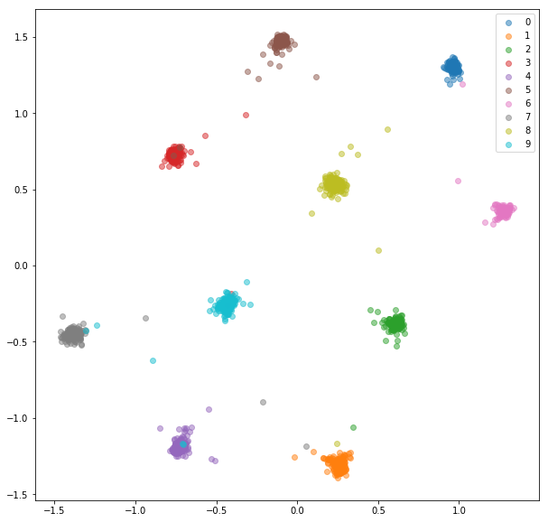
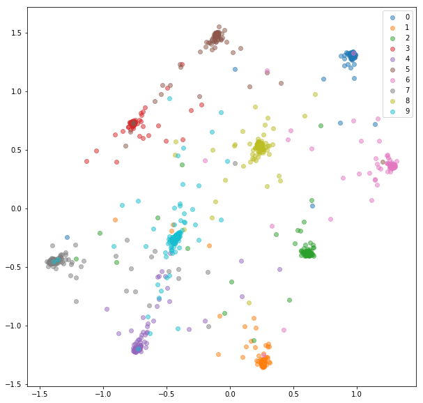
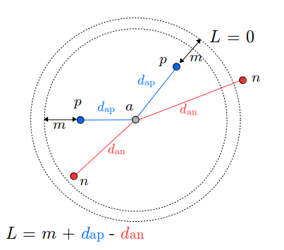
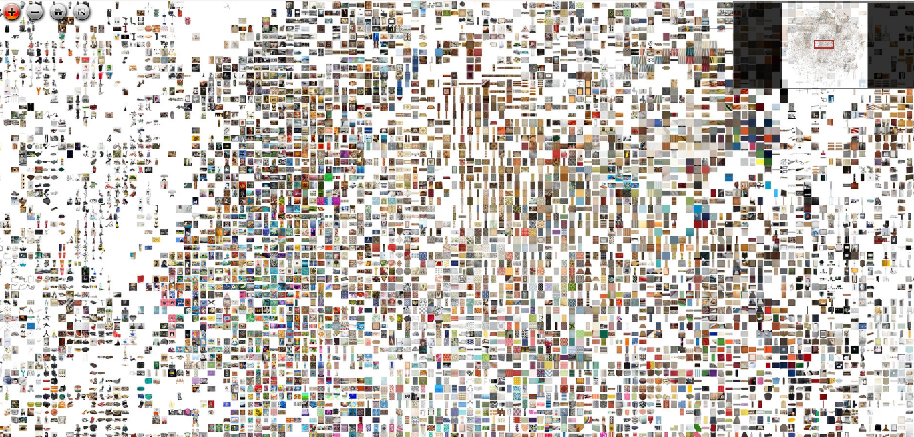

Deep Metric Learning
===

###### Computer Vision Master, module M5, course 2021-22

###### Joan Serrat


---

Contents
===

1. What is and why
1. Architectures and loss functions
1. Implementation
1. Mining
1. Applications : image retrieval, face verification, re-id, few-shot learning, patch correspondence, tracking
1. I want to try

---

1$.$ What is and why
===


---

## Metric ##
Function $f(x,y)$ that defines a distance between a pair of elements in a set. Distance is thus a measure of similarity.

Satisfies
- $f(x,y) \geq 0$
- $f(x,y) = 0$ iif $x=y$ 
- $f(x,y) = f(y,x)$
- $f(x,z) \leq f(x,y) + f(y,z)$

Example : 
- Euclidean distance $||x-y||^2_2$
- Mahalanobis distance $(x-\mu)^t \Sigma^{-1} (x-\mu)$

---

Mahalanobis: 2d Gaussian samples with non-diagonal $\Sigma_1=\Sigma_2$, $\mu_1\neq\mu_2$

<center></center>
<!-- 
<center></center> 
<center></center>
-->

---

We'll be more interested in distances **learnable** from data, like $(x-y)^\intercal \, A \, (x-y)$ in order to **impose our own notion of similarity**

Let **$S$** set of pairs of samples considered **similar** (e.g same class) and **$D$** set of **dissimilar** pairs. 

It is possible to optimize

$\Sigma^{-1} = {\arg \min}_A\;\; \displaystyle\sum_{x_i,x_j \in S}(x_i-x_j)^\intercal \, A \, (x_i-x_j)$

subject to $\displaystyle\sum_{x_i,x_j \in D}(x_i-x_j)^\intercal \, A \, (x_i-x_j) \geq 1$

and $A \succeq 0$ (semidefinite positive : $x^\intercal A x \geq 0, \; \forall x$)

---

## Why learn a distance ?

Being able to compare two things, i.e. measure their degree of similarity is **ubiquitous**

- **classification** : distance between samples and class prototypes for nearest class mean, or $k$-nearest neighbors
- **image retrieval** : obtain the $k$ most similar images in the *gallery* to a *query* image
- **tracking** : get the most similar bounding box to a target's bbox in previous frame
- **stereo** : find corresponding patch in $I_{left}$ to a patch in $I_{right}$ as the most similar

<br>

plus several other tasks we will show in the applications part

---

## Why learn a *deep* metric ?

- like in traditional classification, detection, semantic segmentation ... in classic metric learning, metrics were learned from **handcrafted features $\Rightarrow$ subobtimal**
- in deep learning **features are learned**
    - transform the represention of an object to a new representation
    - in an **embedding space**, with less dimensions
    - such that objects we say are similar, will be close, and different will be far
- even if the images are from **different domains** ! eg. image and sketch

---

## Example 1 : classification
- learn a distance between MNIST digits according to their class, equivalently
- learn an embedding for MNIST mapping images of a same digit to a cluster, separated from cluster of other 9 digits

Figures from https://github.com/adambielski/siamese-triplet

CNN conv 5x5x32 $\rightarrow$ PReLU $\rightarrow$ MaxPool 2x2 $\rightarrow$ conv 5x5x64 $\rightarrow$ PReLU $\rightarrow$ MaxPool 2x2 $\rightarrow$ Dense 256 $\rightarrow$ PReLU $\rightarrow$ Dense 256 $\rightarrow$ PReLU $\rightarrow$ **Dense 2** $\rightarrow$ PReLU $\rightarrow$ Dense 10 $\rightarrow$ Softmax, Cross-entropy

---

| Cross entropy, Dense 2 | Metric learning train | test |
|:--:|:--:|:--:|
|  |  |  |

Possibe to classify by distance. But cross-entropy performs better on large datasets$^1$
###### $^1$ Significance of Softmax-based features in comparison to distance metric learning-based features. Shota Horiguchi, Daiki Ikami, Kiyoharu Aizawa. T-PAMI, Vol. 42, No. 5, 2020.

---

## Example 2 : localization

###### Localizing and orienting street views using overhead imagery. Nam N. Ho, James Hays. *arXiv*:160800161v2.

Train with 900K corresponding pairs (street view, aerial view) from 8 US cities

<center></center>

---

## Example 2 : localization

<center></center>

Test with ~70K pairs per city of **3 other cities** $\rightarrow$ recall@1% = 700 images = 0.5, ie, for half of the queries the true match is in the top 1%

---

## Example 3 : sketch to 3d

###### Sketch-based 3D Shape Retrieval using Convolutional Neural Networks. Fang Wang, Le Kang, Yi Li. *arXiv*:1504.03504v1.

<center></center>

Try it in this [cool online demo](http://users.cecs.anu.edu.au/~yili/cnnsbsr/)


---

Sketch queries and top 10 answers

<center></center>

2$d$ PCA projection of sketches and 3$d$ models in the 64$d$ learned common embeding

---

## Example 4 : *Terrapattern*

"Visual serach engine for satellite imagery" = image retrieval by metric learning. 
CMU project 2016


https://www.youtube.com/watch?v=AErDoe-5Ol4 play 1:11 to 3:56

---

2$.$ Architectures and loss functions
===


---

# Seminal works

###### J. Bromley, I. Guyon, Y. Lecun et al. Signature Verification using a "Siamese" Time Delay Neural Network. NIPS'<font color="red">94</font> 

###### S. Chopra, R. Hadsell, Y. LeCun. Learning a similarity metric discriminatively, with application to face verification. CVPR'<font color="red">05</font>

###### R. Hadsell, S. Chopra, Y. LeCun. Dimensionality reduction by learning an invariant mapping. CVPR'<font color="red">06</font>

In 2014 several papers at top conferences on descriptors for patch matching, face verification and recognition. On *Labeled Faces in the Wild*, 99.15% accuracy! 

Since then, variant architectures, new applications, loss functions, mining strategies ...

---

Typical Siamese architecture
===

<center></center>

---

## Contrastive loss

Let be
- $f(x)$ the $d$-dimensional vector produced by the network branch
- $x_1, x_2$ inputs to branches
- $y=0$ if $x_1$ is deemed similar to $x_2$ and 1 if not
- $m$ a margin value, usually 1.0

$$ D = ||f(x_1) - f(x_2)||_2$$
$$L(x_1, x_2, y) = (1-y) \; D^2 + y\; (\max\, (0, m - D))^2$$

Meaning:

- if $x_1, x_2$ similar, loss is their squared distance
- if not, loss is zero if $m$ or more appart, and $(m-D)^2$ if not

---

## Contrastive loss

<center></center>

---

## Contrastive loss

<center></center>

---

## Contrastive loss with double margin

Pure contrastive loss similar instances keep *always* being pulled closer, even though they already form tight clusters.

Classes have always some variability, not realistic to ask samples to project to a single point in the embedding.

A **margin** $m_2$ **for similar samples** tells the optimizer not to bother with samples already very close.

$$ D = ||f(x_1) - f(x_2)||^2_2$$
$$L(x_1, x_2, y) = (1-y) \; (\max(0, \, D - m_1))^2 $$
$$+ \; y\; (\max(0, \, m_2 - D))^2$$

---

## Cosine distance

Sometimes the features are L2 normalized
 $$f(x) \rightarrow \frac{f(x)}{||f(x)||_2}$$

They live in the surface of a $d$-dimensional sphere. The Euclidean distance of normalized vectors is the **cosine distance** or scalar product.

$$L(x_i, x_2, y) = \frac{1}{2} \; \Big(\, y - \frac{f(x_1) \cdot f(x_2)}{||f(x_1)||_2 ||f(x_2)||_2}  \,\Big)^2$$

---

## Cosine distance

<center></center>

Unlike Euclidean distance, this is bounded $\rightarrow$ minimization of contrastive loss is not dominated by pairs generating extreme gradients.

---

## Distance based logistic

Convert the **Euclidean distance into a probability** of being similar instances, and then use the standard **cross-entropy** loss (also called log-loss) of classification networks :

$$p(x_1, x_2) = \displaystyle\frac{1+\exp(-m)}{1 + \exp(D(x_1,x_2)-m)}$$

$$L(x_1, x_2, y) = -\big(\;(1-y) \log p(x_1,x_2) + y \log(1-p(x_1,x_2)) \; \big)$$

$y=0$ similar, $y=1$ different

---

## Distance based logistic $p(x_1, x_2)$

<center></center>

---

## Distance based logistic $L(x_1, x_2, y)$

<center></center>

---

## Distance based logistic

<center></center>

###### Localizing and orienting street views using overhead imagery. Nam N. Ho, James Hays. *arXiv*:160800161v2.

---


## Variations on the architecture

- all weights of all layers of the two branches are **shared**
- or only those for **first layers** : low level features are the same
- or none, same layers but **independent weights**
- or **different architecture** in each branch

See patch matching in Applications.

---

Triplet networks
===

First proposed in 
###### Deep metric learning using triplet network. Elad Hoffer, Nir Ailon. ICLR'15, arXiv:1412:6622v3.

However, the idea of using triplets of samples instead of pairs was already used in *Large-margin nearest neighbours* (LMNN), a pre-deep metric learning method.

Since they were proposed, they compete with Siameses. Not clear who's better, depends on the task and the dataset.

---

## Architecture

<center></center>

---

## Triplet loss

In contrastive loss we asked for $x_1, x_2$ to be the closest possible if similar, and at least $m$ far away if dissimilar.

Now we want $distance($anchor, negative$)$ to be at least $m + distance($anchor, positive$)$


$$d(p,q) = ||p - q||_2 \;\; , \;\;
d(p,q) = 1 - \displaystyle\frac{p \cdot q}{||p||_2 ||q||_2}$$

<font color="blue"> 

$$L = \max \{\, 0, m + d(a,p) - d(a,n) \, \}$$ 

</font>

$$L = \max \{\, 0, \; 1 - \frac{d(a,n)}{m + d(a,p)} \, \}$$


---

## Triplet loss

<center></center>

---

## Triplet vs Siamese

- learn to *rank* 3 samples, **more context** $\rightarrow$ intuitively better than Siamese for image retrieval
- harder to (naif) train : $n$ samples in dataset, $O(n^3)$ **triplets**
- so **mining** is even more necessary
- **clusters are not required to collapse** to a single point, similar samples only need to be closer to each other than to any dissimilar

--- 

## Triplet vs Siamese


---

# Other losses

## NCA loss$^1$

Not the most popular but simple and specially adapted to retrieval and classification by $k$-nearest neighbors.

Originally proposed to learn a linear transform, later easily adapted to deep learning.

###### $^1$ Neighbourhood components analysis. J. Goldberger, S. Roweis, G. Hinton, R. Salakhutdinov. NIPS'05

---

## NCA loss


**$k$-NN classifier** $f(x;w)$
- $x_1, x_2 \ldots x_n \in \R^D$ training data
- $c_1, c_2 \ldots c_n$ groundtruth class labels
- $\phi(x ; w)$ transform with parameters $w$
- $x \in \R^D, \; \phi(x_{(1)}) \ldots \phi(x_{(k)})$ the $k$ nearest neighbours of $\phi(x)$
- $\hat{c} = mode(c_{(1)} \ldots c_{(k)})$, most frequent label

---

## NCA loss

**Goal**: find $w$ such that average classification accuracy for a new (test) data $x$ by $k$-NN is maximized

**Problems**
- an *infinitesimal* change in $w$ may change the neighbour graph and affect accuracy by a *finite* amount $\rightarrow f$ piece-wise, non-differentiable
- of course, test data are unknown

**Solution**
- instead of yes/no NN, *probability* of being NN
- optimize w.r.t training set, as usual

---

## NCA loss

- $p_{ij} = \displaystyle\frac{\exp{-||\phi(x_i) - \phi(x_j)||^2}}{\displaystyle\sum_{k\neq j} \exp{-||\phi(x_i) - \phi(x_k)||^2}}$   (softmax of Euclidean distances)
probability that $x_j$ nearest neighbour of $x_i$, define $p_{ii} = 0$
- $C_i = \{j \, | \, c_j = c_i \}$ index of samples of same class than $x_i$
- $p_i = \displaystyle\sum_{j \in C_i} p_{ij}$ 
probability that nearest neighbour of $x_i$ is of its same class = probability $x_i$ correctly classified by 1-NN
- finally, $\hat{w} = \underset{w}{\arg \max} \displaystyle\sum_i p_i$
- remember $\phi(x ; w)$ output of neural network with parameters $w$

---

## Normalized softmax losses

Cross-entropy is the preferred loss for classification

- batch $(x_i, y_i), \; i=1\ldots m$, $m=$ batch size
- $x_i$ image
- $y_i \in [1 \ldots n]$, groundtruth label, with $n=$ number of classes
- $f(x)$ logits or betwork output before last fully connected layer
- fc layer is $W^t f(x) + b$

$$
L_{xe} = - \displaystyle\frac{1}{m} \displaystyle\sum_{i=1}^m \text{one-hot}(y_i) \;\; \log \; \text{softmax}\;f(x_i) \\
= - \displaystyle\frac{1}{m} \displaystyle\sum_{i=1}^m \log \displaystyle\frac{e^{W_{y_i}^t f(x_i) + b_{y_i}}}{\sum_{j=1}^n e^{W_{y_j}^t f(x_i) + b_{y_j}}}
$$


---

### Key idea
- by slightly transforming cross-entropy we can, in addition to perform classification, **learn an embedding**
- **typical classification** by $\underset{n}{\arg \max} f(x)$ is equivalent to **minimize a distance** to class "centers" in a certain embedding space

A series of papers use this idea to perform face recognition and verification:

Verification: given two faces *of never seen persons*, do they belong to the same person?

Need to compute a simmilarity or distance between pairs of images.

---

### How ?

- in the fc layer, set the bias to zero, $b_j = 0, j=1\ldots n$
- normalize (L2) the logits $f(x) \rightarrow \tilde{f}(x)$ such that $||\tilde{f}(x)||_2$ = 1
- also normalize the columns of $W$, $||\tilde{W^t_j}||_2 = 1$
- then $\tilde{W^t_j} \tilde{f}(x) = 1 \cdot 1 \cdot \cos \theta$, **cosine similarity**
- maximizie the cosine similarity $=$ minimize the **Euclidean distance** between unitary vectors: $||u - v||_2^2 = 2 - 2 u^t v = 2 - \cos \theta_{u,v}$
- to minimize
$$
L = - \displaystyle\frac{1}{m} \displaystyle\sum_{i=1}^m \log \displaystyle\frac{e^{W_{y_i}^t f(x_i)}}{\sum_{j=1}^n e^{W_{y_j}^t f(x_i)}}
$$
means every $f(x_i)$ close to its $W_{y_i}^t$, that becomes the **"center" or representative** of the class $y_i \in [1\ldots n]$

---

|   |   |
|:--|:--|
| *NormFace: L2 Hypersphere<br> Embedding for Face Verification*. |  |
| *SphereFace: Deep Hypersphere <br> Embedding for Face Recognition*. |  |
| *CosFace: Large Margin Cosine <br>Loss for Deep Face Recognition*. | |
| *ArcFace: Additive Angular Margin<br>Loss for Deep Face Recognition*. |  |

All 2017-18. In practice they need a scale $s$ for the loss to converge.

---

CosFace: effect of margin $m$. Top $f(x)$, bottom embedding $\tilde{f}(x)$


---


Application: face recognition and verification.

Close : new images of known classes at test time

**Open** : **new classes** at test time.

Open is possible becase they have learned an embedding = a similarity measure, a distance to compare things.

---

## *Still* other losses

Many other losses proposed along the past years: see a long list here [Pytorch Metric Learning losses](https://kevinmusgrave.github.io/pytorch-metric-learning/losses/)

What's the best loss ? More on this later...

---

4$.$ Simple implementation in Pytorch
===


---

### A Siamese network

By Adam Bielski https://github.com/adambielski/siamese-triplet

```python
class EmbeddingNet(nn.Module):
    def __init__(self):
        super(EmbeddingNet, self).__init__()
        self.convnet = nn.Sequential(nn.Conv2d(1, 32, 5), nn.PReLU(),
                                     nn.MaxPool2d(2, stride=2),
                                     nn.Conv2d(32, 64, 5), nn.PReLU(),
                                     nn.MaxPool2d(2, stride=2))
        self.fc = nn.Sequential(nn.Linear(64 * 4 * 4, 256),
                                nn.PReLU(),
                                nn.Linear(256, 256),
                                nn.PReLU(),
                                nn.Linear(256, 2))
    def forward(self, x):
        output = self.convnet(x)
        output = output.view(output.size()[0], -1)
        output = self.fc(output)
        return output

    def get_embedding(self, x):
        return self.forward(x)
```

---

```python 
class EmbeddingNetL2(EmbeddingNet):
    def __init__(self):
        super(EmbeddingNetL2, self).__init__()

    def forward(self, x):
        output = super(EmbeddingNetL2, self).forward(x)
        output /= output.pow(2).sum(1, keepdim=True).sqrt()
        return output

    def get_embedding(self, x):
        return self.forward(x)
```

Same thing but normalizes output to 1.0, for cosine similarity for instance.

---

```python
class SiameseNet(nn.Module):
    def __init__(self, embedding_net):
        super(SiameseNet, self).__init__()
        self.embedding_net = embedding_net

    def forward(self, x1, x2):
        output1 = self.embedding_net(x1)
        output2 = self.embedding_net(x2)
        return output1, output2

    def get_embedding(self, x):
        return self.embedding_net(x)
```

```embedding_net``` is an object of class ``EmbeddingNetL2`` or ``EmbeddingNet`` or anything with a forwarding method ``get_embedding()`` and a ``forward()`` with two inputs.

Making a triplet is also a piece of cake.

---

### Triplet network

```python
class TripletNet(nn.Module):
    def __init__(self, embedding_net):
        super(TripletNet, self).__init__()
        self.embedding_net = embedding_net

    def forward(self, x1, x2, x3):
        output1 = self.embedding_net(x1)
        output2 = self.embedding_net(x2)
        output3 = self.embedding_net(x3)
        return output1, output2, output3

    def get_embedding(self, x):
        return self.embedding_net(x)
```

---

### Contrastive loss 
$$y \; ||x_1 - x_2||^2_2 + (1-y)\; (\max\, (0, \, m - ||x_1 - x_2||_2))^2$$


```python
class ContrastiveLoss(nn.Module):
    """
    Takes embeddings of two samples and a target label == 1 if 
    samples are from the same class and label == 0 otherwise
    """

    def __init__(self, margin):
        super(ContrastiveLoss, self).__init__()
        self.margin = margin
        self.eps = 1e-9

    def forward(self, output1, output2, target, size_average=True):
        distances = (output2 - output1).pow(2).sum(1)  # squared distances
        losses = 0.5 * (target.float() * distances +
                        (1 + -1 * target).float() * F.relu(self.margin 
                          - (distances + self.eps).sqrt()).pow(2))

        return losses.mean() if size_average else losses.sum()
```

---

### Triplet loss
$L = \max \{\, 0, m + d(a,p) - d(a,n) \, \}$
$d$ Euclidean or squared Euclidean


```python
class TripletLoss(nn.Module):
    """
    Takes embeddings of an anchor sample, a positive sample 
    and a negative sample
    """
    def __init__(self, margin):
        super(TripletLoss, self).__init__()
        self.margin = margin

    def forward(self, anchor, positive, negative, size_average=True):

        distance_positive = (anchor - positive).pow(2).sum(1)  # .pow(.5)
        distance_negative = (anchor - negative).pow(2).sum(1)  # .pow(.5)
        losses = F.relu(distance_positive - distance_negative + self.margin)

        return losses.mean() if size_average else losses.sum()
```

---

Siamese *online* contrastive loss
===

You can go **much faster** by making the most of the already computed embeddings of a batch of pairs.

For a batch of $n$ pairs we compute $2n$ embeddings but only <font color="blue">$n$ terms</font> are used to minimize the loss.

Why not create **pairs of embeddings** ? $\rightarrow$ much more terms at zero cost $=$ without reading new images or compute new embeddings

- pass through the branch a **batch of $n$ images** $x_{k},\, k=1\ldots n$, being $c_{k}$ their classes
- take the $n$ embeddings $f(x_k)$ and **make all pairs** $\big( f(x_i), f(x_j), y_{ij} \big)$ for $i=1\ldots n, j > i$, with $y_{ij} = 1$ if $c_i \neq c_j$ and 0 else
- now we have <font color="blue">$n(n-1)/2\;$ total terms</font> to minimize the contrastive loss

---

### Siamese *online* contrastive loss

```python
class OnlineContrastiveLoss(nn.Module):
    """
    Takes a batch of embeddings and corresponding labels. Pairs are generated 
    using pair_selector object that take embeddings and targets and return 
    indices of positive and negative pairs
    """
    def __init__(self, margin, pair_selector):
        super(OnlineContrastiveLoss, self).__init__()
        self.margin = margin
        self.pair_selector = pair_selector

    def forward(self, embeddings, target):
        positive_pairs, negative_pairs = self.pair_selector.get_pairs(embeddings, target)
        if embeddings.is_cuda:
            positive_pairs = positive_pairs.cuda()
            negative_pairs = negative_pairs.cuda()
        positive_loss = (embeddings[positive_pairs[:, 0]] 
                         - embeddings[positive_pairs[:, 1]]).pow(2).sum(1)
        negative_loss = F.relu(self.margin 
            - (embeddings[negative_pairs[:, 0]] - embeddings[negative_pairs[:, 1]])
            .pow(2).sum(1).sqrt()).pow(2)
        loss = torch.cat([positive_loss, negative_loss], dim=0)
        return loss.mean()
```

---

### Pair selector

```python
def pdist(vectors):
    distance_matrix = -2 * vectors.mm(torch.t(vectors)) 
                      + vectors.pow(2).sum(dim=1).view(1,-1
                      + vectors.pow(2).sum(dim=1).view(-1, 1)
    return distance_matrix

class PairSelector:
    def __init__(self):
        pass
    def get_pairs(self, embeddings, labels):
        raise NotImplementedError
```

``pdist`` Pytorch's analogous to SciPy's ```scipy.spatial.distance.pdist``` computes the distance between every pair of vectors in a list

``PairSelector`` abstract class, template for other pair selectors doing mining.

---

```python
from itertools import combinations

class AllPairsSelector(PairSelector):
    """
    Discards embeddings and generates all possible pairs given labels.
    If balance is True, negative pairs are a random sample to match 
    the number of positive samples
    """
    def __init__(self, balance=True):
        super(AllPositivePairSelector, self).__init__()
        self.balance = balance

    def get_pairs(self, embeddings, labels):
        labels = labels.cpu().data.numpy()
        all_pairs = np.array(list(combinations(range(len(labels)), 2)))
        all_pairs = torch.LongTensor(all_pairs)
        positive_pairs = all_pairs[(labels[all_pairs[:, 0]]
                                    == labels[all_pairs[:, 1]]).nonzero()]
        negative_pairs = all_pairs[(labels[all_pairs[:, 0]] 
                                    != labels[all_pairs[:, 1]]).nonzero()]
        if self.balance:
            negative_pairs = negative_pairs[torch.randperm(len(negative_pairs))
                             [:len(positive_pairs)]]
            # as much negatives as positives
        return positive_pairs, negative_pairs
```

Note: tensor ``labels`` gpu $\rightarrow$ cpu $\rightarrow$ numpy $\rightarrow$ ``all_pairs`` $\rightarrow$ gpu tensor. Better do ``combinations`` in gpu, but how? ``torch.cartesian_prod(tensor_a, tensor_b)``

---

### Balanced sampler

However, the vast majority of **pairs** are of dissimilar classes, $y_{ij}= 1$. Instead, program a **balanced batch sampler** inheriting from Pytorch's ``BatchSampler`` to get $k$ random samples for each of $p$ random classes and gain control on same/different pairs. See class ``BalancedBatchSampler``

Same goes for **triplet loss** : from a batch of $3n$ images you can get $6n^2 - 4n$ valid triplets instead of just $n$.

---

### Advantages

- **each image is read and passes through the network just once**, but appears in many pairs

- in the middle, you can introduce hard pairs **mining** (hard positive and/or hard negative *batch* mining for triplets) by **selecting interesting pairs/triplets** of embeddings.

- now you can train with batches of **1s-10s-100s of thousands of pairs, triplets**, depending on image size. 

- consequently, training 
    - is much **faster**
    - may converge to a **better minimum**

- it's the normal way found in papers.

---

3$.$ Mining
===


---

## What

Mining is to filter or select the training samples to keep the most difficult ones. Here samples = pairs or triplets.

## Why

- the number of possible pairs / triplets is large, $O(n^2) / O(n^3)$, $n=10^k$
- the network learns relatively quickly to cluster similar samples and separate dissimilar ones **when they are "easy"**
- this **seems good but it's not**: from then on, in a batch a large fraction of them become uninformative, that is, produce zero cost $\rightarrow$ zero gradient $\rightarrow$ no weights updates
- therefore, convergence takes much **longer** and probably reach a **not so good local minimum**

---

## How

- look for **hard** $=$ difficult cases and train with them
- a sample is hard means it breaks the margin constraint and has a high cost
- in Siamese, pairs  $(p,q)$ similar (e.g. same class) but far away in the embedding space, or the opposite, 

$$d(p_a,q_b) < m, a \neq b, \;\; d(p_a,q_b) \gg 0, a=b$$

- in triplets, $\{(a,p,n) \; | \; d(a,n) < d(a,p)+m\}$
- we can mine 
    - **hard negatives** $q_{b\neq a}$ given $p_a$, $n$ given $a, p$ and/or 
    - **hard positives** $q_a$ given $p_a$, $p$ given $a, n$   

---

<center>

<!--  -->
<font color="green">hard positives</font>
<font color="red">hard negatives</font>
</center>


---

## How to mine

- **offline** hard mining : transform the **whole training set** and look for the hardest pairs / triplets, from time to time
- **online**, also batch or semi-hard : do this only for the samples of **current batch**
- offline is much more costly and can make training go bad as it always samples **too difficult** cases
- online is much faster and **not so hard**, as only a small subset of the training set is considered each time

---

## A mining strategy for contrastive loss

###### Deep Metric Learning via Lifted Structured Feature Embedding.  Hyun Oh Song, Yu Xiang, Stefanie Jegelka, Silvio Savarese (Stanford U., MIT). CVPR'16.

Standard contrastive loss for batch of pairs in batch $B$
$$J = \displaystyle\sum_{(i,j) \in B} y_{ij}\,d_{i,j}^2 + (1-y_{ij}) \, [m - d_{ij}^2]_+$$

Idea: instead of just $|B|$ pairs (positive and negative), consider **all possible pairs and mine hardest negative for each positive pair**

---

$P, N$ set of positive, negative pairs **in batch** $B$

$$J = \displaystyle\sum_{(i,j) \in P} \max \,(0, J_{ij})$$
$$J_{ij} = \max \Big( 
\max_{(i,k) \, \in \, N} (m - d_{ik}), 
\max_{(j,l) \, \in \, N} (m - d_{jl}) \,
\Big) + d_{ij}$$

<font color="blue">maximize dist to hardest negative wrt $i$ and hardest negative wrt $j$, minimize dist positives $i,j$</font>

<center>

</center>

---

But they observe nested maxs and hardest negatives to cause convergence to bad local minima $\rightarrow$ replace loss by **smooth upper bound**

$$J_{ij} = \log \Big( 
\sum_{(i,k) \, \in \, N} e^{m - d_{ik}} + 
\sum_{(j,l) \, \in \, N} e^{m - d_{jl}} \,
\Big) + d_{ij}$$

|  |  |
|:---:|:---:|
| $\max(x,y)$ | $\log(e^x + e^y)$ |

---

## Does it make a difference ?

Image retrieval, Recall@K on three datasets

|  |  |  |
|:---:|:---:|:---:|
| Cars-196 | CUB-200 | Stanford products | 

---

2d t-SNE of 64-d embedding for Cars-196

<center>

</center>

---

## Some mining estrategies for triplets

###### In defense of the triplet loss for person re-identification. arXiv:1703.07737v4

Re-Id : given a query image, find its id (who is) as the one of the **closest image in the gallery**, made of at least one image per id.

Re-Id $=$ **recognition with many classes**, one per id, and very few samples per class. 

Dataset Market-1501, 750 ids train and **751 ids test**. Not so many? MS-Celeb-1M has **50K test identities**!

This papers compares different **triplet mining strategies for re-id** wrt one same dataset.

---

##### Standard triplet loss

A batch of size $B$ is made of ***B*** **triplets** $\{\, (a_i,p_i,n_i)\, , i=1\ldots B\, \}$ where $a_i$ and $p_i$ come from one same id and $n$ from a different one. Since $B <$ number of ids, we can afford $id(a_i) \neq id(a_j), \forall \, i, j$.

$$L_{tri} = \displaystyle\sum_{i=1}^B \big[\, m + d(a_i,p_i) - d(a_i,n_i)\,\big]_{+}$$

$B$ triplets $\rightarrow$ $3B$ images but $B$ terms

---

##### Batch hard loss

A batch is made by sampling

- $P$ ids without replacement 
- $K$ images per id

with $3B \approx PK$  images. 

If $x^i_j$ means the network output for $j$-th image of $i$-th id ,

$$
L_{BH} = \displaystyle\sum_{i=1}^P \displaystyle\sum_{a=1}^K 
\big[\, m + \max_{p=1 \ldots K} d(x^i_a, x^i_p) \; - \min_{j\neq i \,,\, n=1\ldots K} d(x_a^i, x_n^j) \, \big]_+
$$

<font color="blue">for all images as anchor, sum $\big[m +$ hardest positive $-$ hardest negative $\big]_+$</font>

$3B$ images $\rightarrow$ $3B$ terms

---

##### Batch all loss

$$
L_{BA} = \displaystyle\sum_{i=1}^P \displaystyle\sum_{a=1}^K \;
\displaystyle\sum_{p=1,p\neq a}^K \; 
\displaystyle\sum_{j=1,j\neq i}^P \; \displaystyle\sum_{n=1}^K
\big[\, m + d(x^i_a, x^i_p) - d(x_a^i, x_n^j) \, \big]_+
$$

<font color="blue">for all images as anchor, for all positives, for all negatives, sum $\big[\, m + d(a, p) - d(a, n) \, \big]_+$</font>

$3B$ images $\rightarrow$ $PK(PK-K)(K-1)=6B^2 - 4B$ terms


##### Batch all non-zero loss

$L_{BH\neq 0}$ same as before but <font color="blue">sum only the non-zero terms $[m+\ldots ]_+$</font>

Different because **all losses are averaged later**.

---

##### Lifted embedding loss for triplets

$$
L_{L} = \displaystyle\sum_{i=1}^B 
\big[\, d(a_i,p_i) + \log \displaystyle\sum_{n\neq a_i, n\neq p_i} \big( e^{m-d(a_i,n)} + e^{m-d(p_i,n)} \big) \,\big]_{+}
$$

Similar to batch all only that for a batch size $B$,
- $B$ pairs (anchor, positive)
- negatives are all but the anchor and positive ($3B-2$)
- replace hard margin by smooth upper bound

---

##### Lifted embedding loss for triplets

$$
L_{LG} = 
\displaystyle\sum_{i=1}^P \displaystyle\sum_{a=1}^K \;
  \big[ \log \displaystyle\sum_{p=1,p\neq a}^K e^{d(x^i_a, x^i_p)} +
        \log \displaystyle\sum_{i=1,j\neq i}^P 
             \displaystyle\sum_{n=1}^K e^{m-d(x^i_a, x^j_n)}
  \big]
$$

<font color="blue">$~~~~~~~~~~~~$all anchors$~~~~~$all positives, $~~~~~~~~~~~~~~~$all negatives</font>

---

## Do they make a difference ?

<center></center>

- all online mining losses are better (and faster!) than simple offline OHM
- vanilla triplet loss $L_{tri}$ performs poorly
- batch hard consistently better than batch all, "washing out" of the few non-zero terms in BA confirmed by BA$\neq 0$
- improvement for a range of margins $m$
- no claims out of the re-id problem and market-1501 dataset

---

### A Mining implementation

```python
class HardNegativePairSelector(PairSelector):
    """
    Creates all possible positive pairs. For negative pairs, pairs with smallest distance 
    are taken into consideration, matching the number of positive pairs.
    """
    def __init__(self, cpu=True):
        super(HardNegativePairSelector, self).__init__()
        self.cpu = cpu

    def get_pairs(self, embeddings, labels):
        if self.cpu:
            embeddings = embeddings.cpu()
        distance_matrix = pdist(embeddings)

        # like above, make positive_pairs and negative_pairs
        ...

        negative_distances = distance_matrix[negative_pairs[:, 0],
                                             negative_pairs[:, 1]]
        negative_distances = negative_distances.cpu().data.numpy()
        top_negatives = np.argpartition(negative_distances, len(positive_pairs))
                        [:len(positive_pairs)]
        top_negative_pairs = negative_pairs[torch.LongTensor(top_negatives)]

        return positive_pairs, top_negative_pairs
```

Note: again gpu $\rightarrow$ numpy $\rightarrow$ gpu to use ```np.argpartition```

---

## What's the best loss and mining ?

###### $^1$ A Metric learning reality check. Kevin Musgrave, Serge Belongie, Ser-Nam Lim. Cornell Tech, Facebook AI. ECCV'20.

- deep ML papers from past 4 years have claimed **great advances in accuracy**
- they take a closer look to **see if this is actually true**
- find **flaws in the experimental setups** = common malpractices
- probably not exclusive of deep metric learning, but more general
- **properly compare** a dozen of metric learning papers = loss + miner
- experiments show **improvements have been marginal at best** for image retrieval in 3 benchmark datasets

---

##### 1. Unfair comparison

or tricks to improve accuracy over past works

- use of **better architectures**, eg GoogleNet $\rightarrow$ ResNet50

- **increase the dimension** of the embedding space

- **better data augmentation** strategies, sometimes those reported $\neq$ from coded

- different **optimizers** and **learning rates**

- omission of **key details** with impact on the result (as read in code comments)

- **no confidence intervals** from several runs, only results of best trial

---

##### 2. Training with test set feedback

- at training, the test set accuracy of the model is checked at regular intervals
- and the best test set accuracy is reported
- no validation set : **model selection and hyperparameter tuning done with feedback from the test set** $\rightarrow$ overfitting

---

##### 3. Weak IR accuracy metrics

- most ML papers report Recall@K, Normalized Mutual Information, F1 score
- on these three 2d-embeddings the three metrics report the **same values** despite the **varying degree of class clusterization**


---

##### What do they do ?

- fix the architectures, embedding dimensions
- fix training process & hyperparameters : batch size, learning rate, data augmentation, optimizer, train / test class split, cross-validation etc. etc.
- new, better metric **MAP@R** = MAP of the R nearest neighbors
    - given a test sample, find the R nearest neighbors
    - count how many of them are of the same class as the sample
    - the more, the better
    - if closest neighbors are those of the same class, it's better

- also report Recall@1 = **Precision@1**
    - how many times the nearest sample is of the same class

---

MAP@R for 12 ML methods under same conditions, on 3 datasets : **no clear winner** 


---

Same for **Precision@1**


---


---

##### Conclusions

- Contrastive and triplet losses (+ mining) are strong baselines
- Authors just copied numbers of previous papers instead of trying to obtain a more reasonable baseline by implementing the losses themselves and try them on proposed networks etc.
- *"With good implementations of those baseline losses, a level playing field, and proper machine learning practices, (...) methods perform similarly to one another, whether they were introduced in 2006 or 2019"*
- but this is only for image retrieval, on 3 datasets

---

5$.$ Applications
===

<!--

Conditional similarity networks
===

###### Conditional Similarity Networks. Andreas Veit, Serge Belongie, Theofanis Karaletsos. arXiv:1603.07810

<font color="red">TODO</font>

---

-->

---


Image retrieval
===

###### Learning visual similarity for product design with convolutional neural networks. Sean Bell, Kavita Bala (U. Cornell). ACM Trans. on Graphics (SIGGRAPH'15).

<center></center>

---

### <font color="blue">Interest</font>
- retrieval $\neq$ classification
- two image domains
- compares learning features with metric learning and with classifier learning
- contrastive loss combined with cross-entropy
- nice visualiation of the learned embedding

---

### <font color="blue">Goal</font>
- learn an embedding for visual search of products in **interior design**
- **identify products on catalogs** from pictures of scenes or catalogs: *where can I find this ?*, *find me chairs similar in style to this one*
- search for **matching products** : *find me products combining with this armchair*
- learn an embedding (distance) for images from **two domains**: crops from photos of scenes and product catalogs
- **difficult** because in-situ object images have varying backgrounds, scale, lighting, size, orientation $\ldots$ compared to catalogs 

---

### <font color="blue">Dataset</font>
- 7M product photos and 6.5M room photos from [Houzz.com](Houzz.com)

<center></center>

- duplicate and near-duplicate detection by clustering fc7 layer of AlexNet $\rightarrow$ 3.4M product and 6.1M room images
- out of 3.4M, only 178,712 product photos are product tags
- Mechanical Turk with quality control $\rightarrow$ final **102K pairs (in-situ bounding box, product image)** for $2500, $1.5/hour
- for each of the 102 K positive pairs, 20/80 random images of products different/same category $\rightarrow$ **64M training pairs**
- from **unseen** 6400 room pictures, **10K test pairs**

---

### <font color="blue">Retrieval task</font>
- it's not about classification $=$ given a test image find the most similar images **in the training set**
- train with similar/dissimilar pairs to learn a distance
- at test time we have **new pairs of images**, possibly of **different classes**
- for each pair, one image is the **query** and the other the **target** or tagged
- for every query ask for $k$ most similar images and count how many times the target is in the answer, on average : **mean recall @ k**


---


### <font color="blue">Method</font>

<center></center>

CNN = GoogLeNet, AlexNet
A : product category classification and then features for embedding
B : Siamese, plain contrastive loss
C : category prediction $+$ contrastive loss
D : same as C with L2 normalization, **best**

---

### <font color="blue">Evaluation</font>

On a test set of 10K pairs
<center></center>

---

### <font color="blue">Random queries</font>
<center></center>

### <font color="blue">Embedding</font>

256 dimensions projected to 2D with t-SNE
http://www.cs.cornell.edu/~sbell/siggraph2015-embedding.html cool!

---


---



---


---
Verification and clustering
===

###### Facenet: a unified embedding for face recognition and clustering. Florian Schroff, Dmitry Kalenichenko, James Phiblin (Google). 2015.

### <font color="blue">Interest</font>
- large scale learning, HUGE amounts of data
- landmark in face verification
- triplet loss with negatives batch hard mining
- results

---

### <font color="blue">Goal</font>
- verification : given two pictures,  predict whether the two images are from the same person or not
- check effect of large scale : train with millions, 10s and 100s millions of images

--- 

### <font color="blue">Method</font>
- Inception type network
- triplet loss with batch **semihard** negative mining : "*selecting the hardest negatives can lead to bad local minima early on training*"
$$ d(a_i, p_i) < d(a_i, n_i) < m$$
- embedding dimension 128
- batches of 1800 triplets
- trained during 1000 - 2000 hours = 2.7 **months**

---

### <font color="blue">Method</font>
- train with undisclosed dataset of **200 million images** of **8 million identities**
- then take another dataset (personal, LFW), split it in 10 folds
- from first 9 folds, learn the threshold *on the distance* for same/different id classification
- test with the last fold, repeat for every fold

<center>
"<i>Compared to only millions images, tens of millions of exemplars result in a clear boost of accuracy (60% less error). Hundreds of millions still gives a small boost but the improvement tappers off.</i>"
</center>

---

### <font color="blue">Results</font>
- Labeled Faces in the Wild (2009) is a benchmark dataset for face recognition and verification
- 13K images, 1680 identities with 2+ images (but MS-Celeb-1M has 8.4M images of 100K identities)
- **99.63%** verification accuracy, 3 times less error than best previous work

---

|               |               |
| ------------- |:-------------:|
| The **only** errors           |  |

---

<!--

###### How to train triplet networks with 100K identities ? Chong Wang, Xue Zhang, Xipeng Lan (Orion Star). ICCV'17.

<font color="blue">Goal</font> : large scale face recognition on MS-Celeb-1M
- train set : **100K** identities and 8.4M images
- test set : 50K images with **only 75% identities also in the training set**

<font color="blue">Why triplet network ?</font>

- softmax layers with extremely large number of classes takes too much GPU memory
- when number of images per class is low ($<$ 5) performance drops

<font color="blue">Problems to solve</font>

-->
Re-Id
===

###### Deep Relative Distance Learning: Tell the Difference Between Similar Vehicles. Hongye Liu, Yonghong Tian, Yaowei Wang *et al* (Beijing U.). CVPR'16.

#### <font color="blue">Interest</font>
- (almost) new task
- adapted triplet loss
- adapted Siamese architecture
- dataset

---

#### <font color="blue">Person re-identification</font>
- In video surveillance, when being presented with a person-of interest (query), person re-ID tells **who is**: returns **images of this same person** previously observed in another place/time/camera , **or tells it's unknown**
- retrieve image(s) of the same person from a **gallery**
- challenging : match two images of the same person under **intensive appearance changes** such as lighting, person pose, camera and viewpoint
- **in-between of classification and retrieval** : in re-id training and testing identities may not overlap (but in the vast majority of papers they do) $\rightarrow$ closed world re-id $\approx$ classification
- however, very **few samples/class** and **many ids**


---

#### <font color="blue">Vehicle re-identification</font>

<center></center>

---

#### <font color="blue">Vehicle re-identification</font>

Differently from person re-id, two different vehicles of same maker-model-year could be equal, but in practice they normally are not because of **characteristic details**.

<center></center>

---

#### <font color="blue">Mehod : architecture</font>
- two vehicles have definitely different id if from different models
- if not, then take into account the characteristic details
- special Siamese network : one branch for same/different model detection, another branch for same/different id 

<center></center>

attribute = maker + model + year, "Audi A4L 2009"

---

#### <font color="blue">Mehod : modified triplet loss</font>

|  | $a \longleftrightarrow p$ |  |
|---|---|---|
| with standard triplet loss, loss $>$ 0 | | loss $=$ 0 but $p, n$ **alineated** |

How to deal with wrong anchor choices ? For each id, replace their anchors by an *estimation* of the class center.

---

#### <font color="blue">Mehod : modified triplet loss</font>

$X^p = \{ x_1^p \ldots x_{N^p}^p\}$ samples of **one** same id
$X^n = \{ x_1^n \ldots x_{N^n}^n\}$ samples of other ids
$c^p = \frac{1}{N^p} \displaystyle\sum_i x_i^p$ estimated id center at present
$x_\star^n = \arg\min_j ||c^p - x_j^n||_2$ hardest negative, nearest to $c^p$
$L(X^p, X^n) = \max\{ \, 0, \, m + d(x_i^p, c^p) - d(x_\star^n, c^p) \,\}$

<center></center>

---

#### <font color="blue">VehicleID dataset</font>
- 220K images of 26K vehicles, 8.4 images/vehicle
- both frontal and rear views
- multiple cameras

<center></center>

---

#### <font color="blue">Results</font>
- 50/50 train/test
- test samples further divided into 3 test splits, small/medium/large with **800/1600/2400 query** vehicle images (1 per id), to ressemble person re-id datasets
- recall at top-5 : **0.73, 0.67, 0.62** small/medium/large test split
- recall at top-1 : **0.49, 0.43, 0.38** 

---

Few-shot learning
===

###### Prototypical networks for few-shot learning. Jake Snell, Kevin Swersky, Richard S. Zemel (U. Toronto, Twitter). arXiv:1703.05175v2.

### <font color="blue">Interest</font>
- new difficult task
- realistic, open recognition
- new training algorithm, *episodes*

---

#### <font color="blue">What's few-shot learning</font>

- a classifier must generalize to new classes not included in the training set
- given only a small number of examples for each new class
- can't retrain the model with the new data because it would severely overfit the new classes
- but humans can recognize new classes, even from one exemplar (one-shot)

---

#### <font color="blue">Method</font>
- learn an embedding in which samples from one class cluster around a single prototype representing that class
- this will happen also for new classes to come
- prototype is the mean
- classification is performed by nearest prototype = nearest class mean
- the network computing the embedding is trained trying to mimic the arrival of new few-shot classes
- so that at test time it will perform better

---

$S = \{(x_1, y_1) \ldots (x_N, y_N)\}, x_i\in R^D, y_i \in \{1\ldots K\}$, dataset of $N$<font color="blue"> samples</font> from $K$ <font color="blue">classes</font>
$S_k$, <font color="blue">samples of class $k$</font> 
$f_\phi(x)$, <font color="blue">embedding</font> of sample $x$ when network has parameters $\phi$
$c_k = \displaystyle\frac{1}{|S_k|} \sum_{x_i\in S_k} f_\phi(x_i)$, <font color="blue">prototype</font> of class $k$
$p_\phi(y=k|x) = \displaystyle\frac{e^{-d(f_\phi(x),c_k)}}{\sum_{l=1}^K e^{-d(f_\phi(x),c_l)}}$, distance $\rightarrow$ probability
$J(\phi) = -\log p_\phi(y=k|x)$ with $k$ true class, <font color="blue">loss function</font>

---

<center>

</center>

Want samples of $Q_k$ to be close to **c**$_k$, computed with samples $S_k$
Each time only a subset of $N_C$ classes is used (indices in $V$)

---

#### <font color="blue">Results</font>

- Omniglot dataset : 1623 handwritten characters from 50 alphabets. 

<center></center>

- 1200 train, 463 test
- 4 blocks of conv 3$\times$ 3 $\times$ 64 + BN + ReLU + maxpool 2 $\times$ 2 $\rightarrow$ for 28 $\times$ 28 images, 64 dimensions
- 2000 episodes of $N_C = 60$ classes, $N_Q=5$ query points per class
- 1-shot 98.8%, 5-shot 99.7% (+0.7%, +3% than previous works)

---

- Tiny ImageNet dataset : 60K images 84 $\times$ 84 of 100 classes, 600 images/class

<center></center>

- 6 splits of 100 classes, 64/16/20 train/validation/test
- 1-shot 49.42%, 5-shot 68.2% (+6% and +8% than previous works)

---
Patch correspondence
===

###### Learning to compare image patches via convolutional neural networks. Sergey Zagoruyko, Nikos Komodakis. CVPR'15.

#### <font color="blue">Interest</font>
- again, task very well suited to metric learning
- seminal work
- tries several Siamese architectures
- at the basis of stereo reconstruction, but stereo papers involve more steps too long to explain

---

#### <font color="blue">Goal</font>
- learn directly from data a general **similarity function to compare image patches**, instead of handcrafted descriptors + euclidean distance
- use it to decide if **two patches are corresponding** to each other or not
- despite changes in **viewpoint, illumination, occlusions, shading, camera** etc.
- why : basis of dense **stereo, structure from motion**, building **panoramas**, **optical flow**...
- investigate what network **architecture** is the best

---

#### <font color="blue">Dataset : Notre Dame, 3d reconstructions</font>

<center></center>

---

|||
|----|----|
| <center>positive pairs</center> | <center>negative pairs</center> |

---

#### <font color="blue">Method</font>

Four architectures are compared to learn the similarity function

<center></center>

<center>1. 2-channel 2. pseudo-siamese (non-shared weights) 3. siamese</center>

---

#### <font color="blue">Method</font>

Four architectures are compared to learn the similarity function

<center></center>

<center>4. central-surround two stream network</center>

---

#### <font color="blue">Method</font>
- output of decision network is scalar in $[0,1]$
- output of branches are concatenated before entering fc layer

- Siamese : learns descriptors
- Pseudo-Siamese : branches don't share weights $\rightarrow$ more flexibiliy, double parameters
- 2-channel : no descriptors, the two patches are concatenated into a 2 $\times$ 3 channels image, at test time $O(n^2)$ inputs
- Central-surround : multiresolution should improve performance

---

#### <font color="blue">Method : Loss function</font>

$N$ number of pairs in minibatch (batch size)
$y_i \in \{+1,-1\}$ groundtruth for pair $i$, corresponding / not
$o_i \in [-1,1]$ output of decision network
$w$ network weights

$$L(y_i,o_i) = \min_w \lambda ||w||_2 + \displaystyle\sum_i \max\;( 0, \; 1-y_i\,o_i)$$

Training:
- each of the three subsets has 500K pairs, half positive half negative
- train with one subset, test with another

---

#### <font color="blue">Results</font>

Metric : False Positive Rate at 95% recall (FPR = FP / TN+FN = probability of false positive, Recall = TP / TP+FN = probability of detection of positives)

<center></center>

- 2-channel best architecture : joint use information of the two patches right from the first layer is better
- Siamese architectures and specially central-surround beat previous best work : importance of multiresolution

---

Tracking
===

###### Fully-Convolutional Siamese Networks for Object Tracking. Luca Bertinetto, Jack Valmadre, Joao F. Henriques, Andrea Vedaldi, Philip H.S. Torr (U. Cambridge). *arXiv*:1606.09549


#### <font color="blue">Interest</font>
- new task, unrelated to classification
- metric learning well suited to it
- VOT'17 challenge winner
- simple !


---

#### <font color="blue">Goal</font>
Tracking **one arbitrary object** in a video, where the object is identified solely by a **bounding box in the first frame**

<center></center>

---

#### <font color="blue">Previous approaches</font>

- learn a model of the object's appearance online, from scratch, using examples from the video
- scarce data $\rightarrow$ only simple models can be learnt
- fast or real-time constraint $\rightarrow$ no time to train a deep network to learn better representations

---

#### <font color="blue">Method</font>
- train a Siamese network to learn a **general** similarity function $f(z, x)$, **offline** 
- $z$ is exemplar or target, $x$ candidate image (sliding window), of same size
- $f(z, x)$, returns a high score if $z$ and $x$ depict the same object, low otherwise
- $f$ is learned from ImageNet Video dataset: 4500 videos of 30 classes of animals and vehicles, +1M annotated frames (bounding box of object)

---

#### <font color="blue">Method</font>
- Siamese $\varphi$ is **fully convolutional**, no fully connected layers $\Rightarrow$ conmutes with translation, no need of sliding windows

<center></center>

- $z=$ **bbox of object** in the **first frame always**, $x =$ **search image**, region around previous detection and $\times 4$ its size
- output of network is not a plain vector but a **feature map** 
- $f(x,z) = \varphi(z) \ast \varphi(x)$ is a **score map**
- $\varphi$ is a **very simple CNN** : 5 conv-maxpool-relu layers

---

#### <font color="blue">Method</font>
- training is done with positive and negative pairs $(x_1, x_2, y) =$ $($exemplar, candidate, $\{+1, -1\})$
- **loss function** : $l(y,x_1,x_2) = \log(1+\exp(-y \, f(x_1,x_2)\,)$
- each training frame produces a large number of positive and negative pairs
- positive pairs are those at a distance less than a threshold to the real object center
- minibatches include exemplar at 5 scales
- at test time, **86 frames per second**


#### <font color="blue">Results</font>

[videos](https://www.robots.ox.ac.uk/~luca/siamese-fc.html)

---

6$.$ I want to try
===


---

But don't have much time...

- Siamese/Triplet networks, off and online sampling, mining etc. from [Adam Bielski's Github](https://github.com/adambielski/siamese-triplet) : simple, easy, has the basics, +1,600 stars

I have time to learn
- [Pytorch Metric Learning by Kevin Musgrove](https://github.com/KevinMusgrave/pytorch-metric-learning/)
    - very well [documented](https://kevinmusgrave.github.io/pytorch-metric-learning/), examples and Colabs
    - very well structured
    - many losses, mining methods
    - customizable, extendable 
    - fast (FAISS library for kNN)

---


---

7$.$ Wrap up
===

- Siamese and triplets are useful for **learning semantic similarity descriptors**
- Metric learning as a number of **applications**
- **Easy to implement** if you know how to make a classification network
- Just need to define a **loss** and sample **pairs or triplets**
- **Versatile** tool : define your own loss function, architecture, miner ...
- In practice, **mining matters** to training time and results
- Active field in deep learning that you should know
