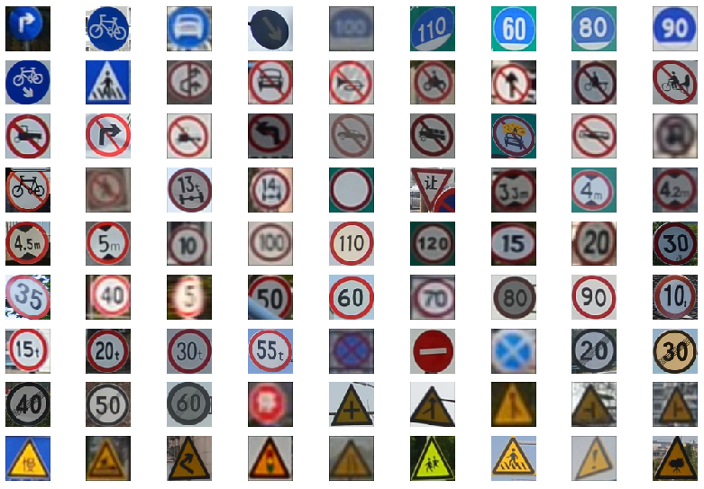
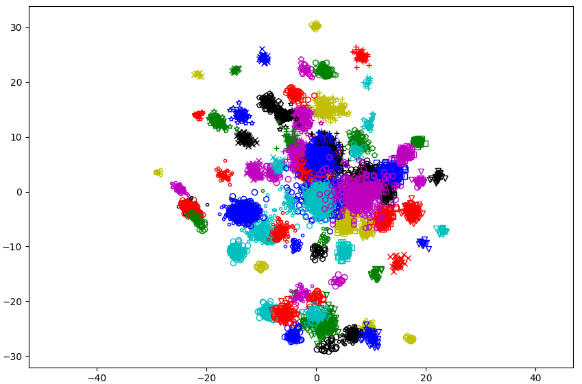
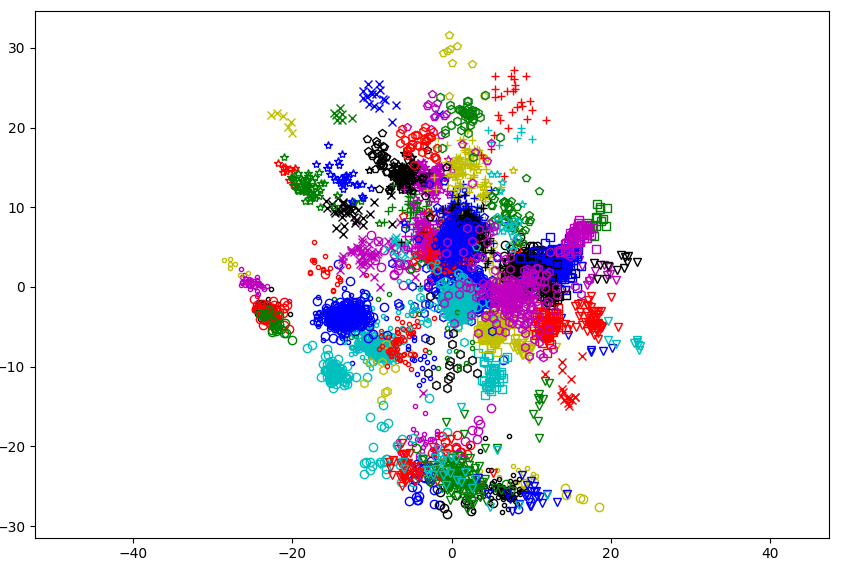

Exercise Metric Learning
===

###### Computer Vision Master, module M5, course 2021-22

###### Joan Serrat

---

Learning goals
===

- *practice* metric learning 
    - losses : contrastive, triplet
    - mining
- for distance-based classification on a small and easy dataset
- visualize the embedding with t-SNE or UMAP
- with PML (recommended) or some other library

---

Dataset: Tsinghua Tencent 100K 
===

- 100K images "in hte wild" of +170 classes of traffic signs in China
- original dataset description [here]((https://cg.cs.tsinghua.edu.cn/traffic-sign/))
- do not download it, but use [our pre-processed version](https://cvcuab-my.sharepoint.com/:u:/g/personal/joans_cvc_uab_cat/EbZHRZYwvJdOhKqVmkTqUpEBns5UePHUDnR1i_pVpgin5w?e=BLKhrg) of the dataset:
    - 81 classes with +20 samples
    - cropped and resized to 64 $\times$ 64 

---

## 81 most populated classes

 

---

### Train samples on an embedding of dimension $d=2$

---

### Test samples

---

What to do
===

1. Split the dataset in train and test parts (each class 80% / 20%)
1. Learn an embedding of dimension $d = 8, 16$ or $32$
1. Perform classification by $k$-nearest neighbor over Euclidean distance to training samples on the embedding space
1. Report accuracy (no need to tweak things to increase it)
    - does mining help ?
    - compare contrastive and triplet loss
1. Visualize the embedding with t-SNE and/or UMAP and analyze it
    - train samples and test samples on separate plots
    - do samples of a class really group together ?
    - do group distances have some relation to class similarities ? classes form a natural hierarchy and some are very similar

---

Grading 
===

Deliverables
- short presentation explaining what have you done and answers to questions
- source code

Pack this into a zip file and to be uploaded to campus virtual.

**0, 0.25 or 0.5 points to be added to the exam**, depending on the completeness and correctness of the answers.

