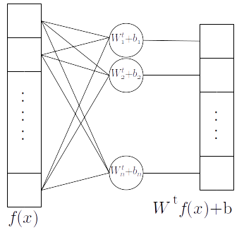
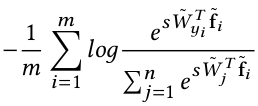
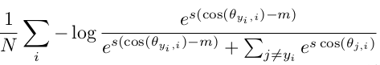
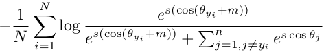

## Cross-entropy meets metric learning

Cross-entropy is the preferred loss for classification

- batch $(x_i, y_i), \; i=1\ldots m$, $m=$ batch size
- $x_i$ image
- $y_i \in [1 \ldots n]$, groundtruth label, with $n=$ number of classes
- $f(x)$ logits or betwork output before last fully connected layer
- fc layer is $W^t f(x) + b$

$$
L_{xe} = - \displaystyle\frac{1}{m} \displaystyle\sum_{i=1}^m \text{one-hot}(y_i) \;\; \log \; \text{softmax}\;f(x_i) \\
= - \displaystyle\frac{1}{m} \displaystyle\sum_{i=1}^m \log \displaystyle\frac{e^{W_{y_i}^t f(x_i) + b_{y_i}}}{\sum_{j=1}^n e^{W_{y_j}^t f(x_i) + b_{y_j}}}
$$

---

### Key idea: normalized softmax loss
- by slightly transforming cross-entropy we can, in addition to perform classification, **learn an embedding**
- **inference** by $\underset{n}{\arg \max} f(x)$ is equivalent to **minimize a distance** to class "centers" in a certain embedding space

A series of papers use this idea to perform face recognition and verification:

Verification: given two faces *of never seen persons*, do they belong to the same person?

Need to compute a simmilarity or distance between pairs of images.

---

### How ?

- in the fc layer, set the bias to zero, $b_j = 0, j=1\ldots n$
- normalize (L2) the logits $f(x) \rightarrow \tilde{f}(x)$ such that $||\tilde{f}(x)||_2$ = 1
- also normalize the columns of $W$, $||\tilde{W^t_j}||_2 = 1$
- then $\tilde{W^t_j} \tilde{f}(x) = 1 \cdot 1 \cdot \cos \theta$, **cosine similarity**
- maximizie the cosine similarity $=$ minimize the **Euclidean distance** between unitary vectors: $||u - v||_2^2 = 2 - 2 u^t v = 2 - \cos \theta_{u,v}$
- to minimize
$$
L = - \displaystyle\frac{1}{m} \displaystyle\sum_{i=1}^m \log \displaystyle\frac{e^{W_{y_i}^t f(x_i)}}{\sum_{j=1}^n e^{W_{y_j}^t f(x_i)}}
$$
means every $f(x_i)$ close to its $W_{y_i}^t$, that becomes the **"center" or representative** of the class $y_i \in [1\ldots n]$

---

|   |   |
|:--|:--|
| NormFace: L2 Hypersphere  Embedding for Face Verification*. |  |
| *SphereFace: Deep Hypersphere   Embedding for Face Recognition*. |  |
| *CosFace: Large Margin Cosine  Loss for Deep Face Recognition*. | |
| *ArcFace: Additive Angular Margin Loss for Deep Face Recognition*. |  |

In practice they need a scale $s$ for the loss to converge.

---

CosFace: effect of margin $m$. Top $f(x)$, bottom $\tilde{f}(x)$

---

Application: face recognition and verification.

Close : new images of known classes at test time

**Open** : **new classes** at test time.

Open is possible becase they have learned an embedding = a similarity measure, a distance to compare things.