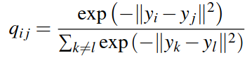

5$.$ Embedding visualization
===

You have trained a network to learn an embedding, a space where similar samples are close and far from dissimilar samples.

But **how good is the embedding, *qualitatively*** ? How are the classes spread on it ? **You want to *visualize* the embedding = view your *test* samples on it**. 

Obvious problem: embedding is a high-dimensional space, $d\gg3$ surely.

Solution: low-dimensional projection with PCA ?

PCA looks for the rotation that concentrates variance (variability) along a few axes and then you can select the 2 or 3 axes with the highest variance.

It turns out that high variance is not the best way to perform dimensionality reduction. **Best means to preserve relative distances when projecting**

---

## t-SNE

Classically ([paper](https://www.jmlr.org/papers/volume9/vandermaaten08a/vandermaaten08a.pdf) published in 2008), t-SNE has been a much used tool / algorithm for high-dimensional embedding projection, for visualization purposes *only*.

 

> t-SNE is capable of capturing much of the local structure of the high-dimensional data very well while also revealing global structure such as the presence of clusters at several scales.

 

**Goal** : given a set of points $x_i \in \R^D$, convert them to $y_i \in \R^d, d \ll D$ *keeping as much as possible the distance relationships in the high-dimensional space*

---

**How does it work ?** In a nutshell$^1$,

1. convert distances in high-dim space to probabilities

$p_{j|i}$ means the probability that $x_i$ would choose $x_j$ as its neighbor if neighbors were picked in proportion to their probability under a Gaussian centered at  $x_i$
1. the value of $\sigma_i$ is the dispersion of neighbors and approximated by

$^1$ [How exactly UMAP works and why exactly it is better than t-SNE](https://towardsdatascience.com/how-exactly-umap-works-13e3040e1668) by N. Oskolkov

---

3. $q_{j|i}, \, y_i, \, y_j$ are the low-dimensional counterparts of $p_{j|i}, \, x_i, \, x_j$ and define $q_{j|i}$ as

but this has problems on crowded regions so authors change it by another distribution (no exponentials :) )
 

4. If the $y_i, \, y_j$ model well the distances of $x_i, \, x_j \; \forall i,j$ in the high-dimensional space then $p_{j|i}$ and $q_{j|i}$ should be *similar*.
 
 KL = Kullback-Leibler *divergence* $\neq$ distance, between 2 distributions, not simmetric. But can be minimized iteratively to find the $y_i$'s

---

## UMAP

t-SNE has been superseded by UMAP. One key difference: t-SNE keeps local structure well but not so much global structure

Read the post *How exactly...*. Apparently different, it bears several similarities with it. Complete explanation is out of scope. By the same author, read this post : [How to program UMAP from scratch](https://towardsdatascience.com/how-to-program-umap-from-scratch-e6eff67f55fe)

---

### How to run t-SNE and UMAP ?

- Scikit-learn has [t-SNE  + usage examples](https://scikit-learn.org/stable/modules/generated/sklearn.manifold.TSNE.html) (and PCA)
- install U-MAP with ``conda`` or ``pip``, [read the docs](https://umap-learn.readthedocs.io/en/latest/)
- both already included in Tensorboard
- **simplest** but slow : upload your data to https://projector.tensorflow.org/

### Cool demos

From the UMAP [documentation](https://umap-learn.readthedocs.io/en/latest/interactive_viz.html) you can interactively explore already computed embeddings of
- [MNIST](https://grantcuster.github.io/umap-explorer/)
- [Fashion MNIST](https://observablehq.com/@stwind/exploring-fashion-mnist/)

